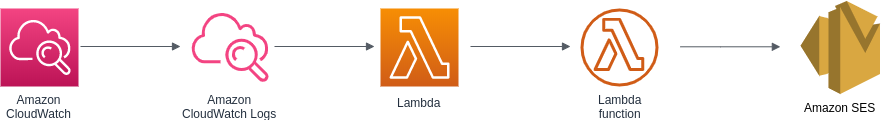
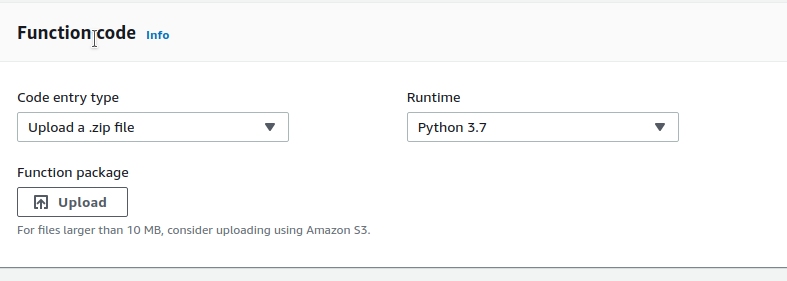
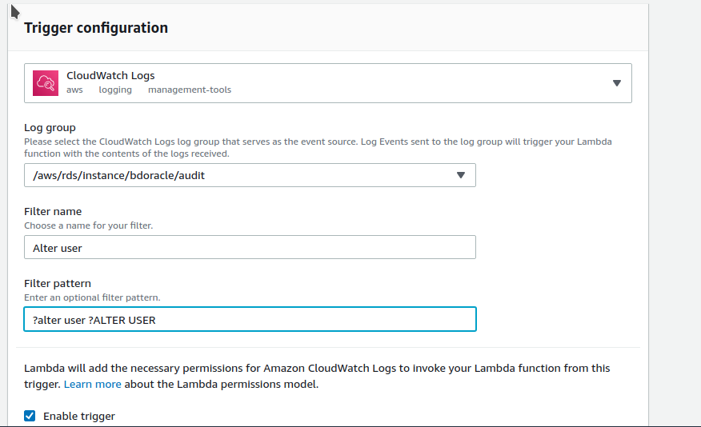
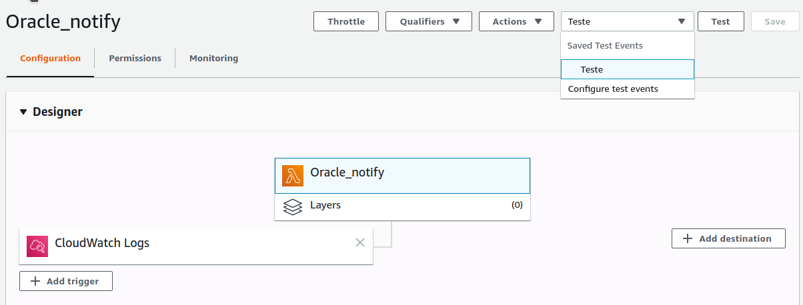
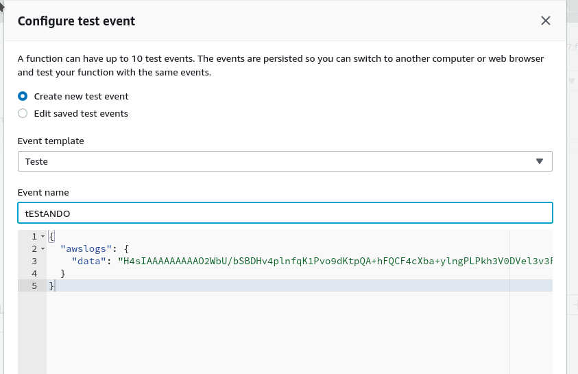
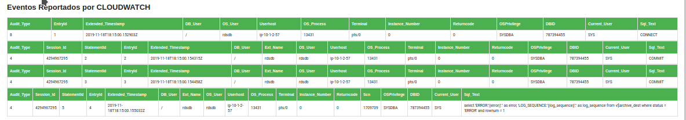

# Lambda for mail Notification 

## Resume
Takes a payload triggered from Cloud Watch logs, parse it in to a HTML table and sends over mail with Amazon SES. 

*In this case the event messages are in xml and will be converted to json for better manipulation.*

## Requesites

1 - Cloud Watch Log Group receiving events in XML 
2 - Lambda Trigger configured for Cloud Watch logs from specific group with optional filters
3 - Validated e-mail in Amazon Simple E-mail Service
4 - This project folder as a zip file to deploy the lambda code and libraries

## Deploy

To deploy this lambda, create a zip file with the files `lambda_function.py` and `xmltodict.py`.

### In AWS CONSOLE

Create a lambda with Python 3.7 runtime.

#### UPLOAD THE CODE

Click in upload and choose the zip file with our python code and send it.

#### CREATE THE TRIGGER

In the lambda designer, click on `ADD TRIGGER` and select *Cloud Watch Logs*, *Log Group* and create a filter as the example image or as you want.

After this, click in `ADD`

### With CLOUD FORMATION

`COMING SOON`

# How It works

- The Lambda receives the event message from cloud watch, decrypt and unconpress it. 
- Takes the json payload and access the key `logEvents`
- Converts the log events in XML to json and appends it to a variable called `message` as a json dump.
- the variable `filtro` receives a list of Keys to be searched in the events, filtering which information should be inserted in the Html table. *`Leave empty to get all event fields available.`*
- For each event, lambdas generates a header with the keys and a line with the respective values. After get all events, concatenate the complete table in a variable.
- The sender, recipient, Subject, Html Body and AWS region are assigned into variables. `*Customize as you wish*`.
- The boto3 library is called to interact with amazon SES and assemble the e-mail and try to send it. If There is an error, it should be shown in the console. If thats all right, you should see a message saying `E-mail Sent!`
  
# How to Test it
## Create a Test Event

You can create a lambda test by clicking in `CONFIGURE TEST EVENTS` as shown in the example image

In the next screen click in create new test as bellow.

You can copy an example in the *`test.txt`* file and put it's contents in aws console respective field.

# Mail Notification example

